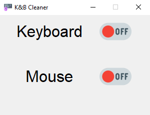

### Keyboard Cleaner

[](https://github.com/toniilic1/Keyboard-Cleaner)
[](https://github.com/toniilic1/Keyboard-Cleaner)
[](https://github.com/toniilic1/Keyboard-Cleaner/graphs/commit-activity)
[](https://github.com/toniilic1/Keyboard-Cleaner/blob/master/LICENSE.txt "License")

## Introduction
Disable either keyboard or your mouse to physically clean them.

You cannot disable both switches and you can always use CTRL+ALT+DEL.

Features pynput library for disabling the devices.

How it looks:



## Installation
1. Clone the project:
- ```git clone https://github.com/toniilic1/Keyboard-Cleaner.git```

2. Create a virtual env:
- ```py -m venv .venv```
- ```.venv\scripts\activate```

3. Install the pynput:
- ```pip install pynput```
or
- ```pip install -r requirements.txt```

4. Run view.py
- ```py view.py```

## License

MIT
